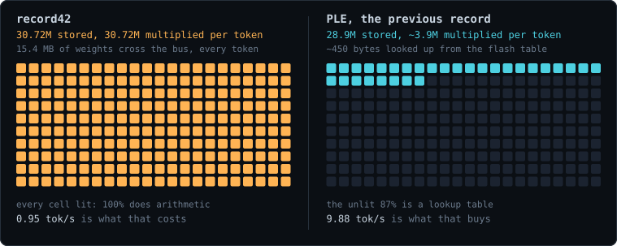

# Running a 30.7M parameter LLM on a microcontroller, densely

<p align="center">
  <a href="https://github.com/JARACH-209">GitHub</a>
  <!-- Add your socials here in the same pattern, they belong above the fold:
  &nbsp;&middot;&nbsp; <a href="https://x.com/YOURHANDLE">X</a>
  &nbsp;&middot;&nbsp; <a href="https://linkedin.com/in/YOURHANDLE">LinkedIn</a>
  -->
</p>



<sub>Real serial capture from the device, replayed. Hardware video below.</sub>

<!-- HARDWARE VIDEO GOES HERE, and it should replace the SVG above once shot.
     One unbroken take: unplug, replug, banner showing fp=8af5c5fe and 30.72M,
     story streaming to the OLED. Save as media/record42.gif and uncomment:


-->

**Every one of those 30.72M parameters is read from memory and multiplied on
every single token. No lookup tables, no cloud, no SD card.**


This is karpathy's [stories42M](https://huggingface.co/karpathy/tinyllamas),
vocabulary-trimmed until it fits a 16MB ESP32-S3, quantized to 4 bits, and
verified token-by-token against the fp32 original before it ever touched the
chip. It boots, prints a fingerprint of its own weights, and writes children's
stories forever. Pull the plug, plug it back in, it still works.

```
=== stories42M on ESP32-S3 :: dense record run ===
model: dim=512 hid=1408 L=8 H=8 kv=8 V=10600 (of 32000) seq=192
pack : 15.36 MB mapped | core Q4 + table Q4 g128
build: bytes=16101008 fp=8af5c5fe | ~30.72M params, all dense-multiplied per token
staged table -> PSRAM (2.67 MB)
staged 1/8 core layers -> PSRAM
config: dual_core=1 display=1 kv16=1 seq=192

>>> Once upon a time, there was a little hanger. The hanger was sad because
it could not hang things like other hangers. It felt ashamed because it was
not as strong as the other hangers.
One day, a little monkey named Mia came to the wardrobe and said, "Why are
you sad, hanger?" [...] From that day on, the hanger was not ashamed anymore,
and the hanger was proud to have true friends.

--- 191 tokens | 201.8 s | 0.95 tok/s (compute 1023 ms/tok) | 30.72M params dense ---
```

## The record, stated precisely

The largest LLM previously run on an ESP32-S3 is
[slvDev's 28.9M PLE model](https://github.com/slvDev/esp32-ai), a genuinely
clever build that keeps 25M of its parameters in a flash lookup table and reads
about 450 bytes of it per token. When it hit Hacker News, the top question was
whether lookup-table parameters should count.

record42 is the other side of that trade.



| | **record42** | slvDev PLE (previous record) |
|---|---|---|
| Stored parameters | **30.72M** | 28.9M |
| Multiplied per token | **30.72M (100%)** | ~3.9M (13%) |
| Weight bytes read per token | **15.4 MB** | ~4.5 MB |
| Speed | 0.95 tok/s | **9.88 tok/s** |
| Connectivity | none | none |

Per token, record42 puts roughly **7.7x more parameters through a
multiply-accumulate** than the incumbent even reads. The price is speed, and
this README says so in the same breath instead of hiding it three scrolls down.

As far as we can tell this is also about **2x the largest dense model ever run
on any microcontroller**. The previous ceiling was stories15M on an 800MHz
Coral board. Nothing above the 15M class had run on an ESP32 at all. If you
know of a larger dense run, open an issue and we will correct this line.

## Numbers

| | |
|---|---|
| Stored parameters | **30.72M** (25.31M transformer core + 5.43M tied embedding) |
| Read per token | all of them: 15.4MB of weights, every token |
| Chip | ESP32-S3 N16R8: 2x 240MHz LX7, 512KB SRAM, 8MB PSRAM, 16MB flash |
| Speed | 0.95 tok/s end to end, 1023 ms/token compute |
| Pack size | 15.36MB in a 15.43MB flash partition |
| Quantization | Q4 group-128 with fp16 scales (4.125 bits/param) |
| KV cache | fp16, 192 positions |
| Kernel | W4A8 integer dot products, split across both cores |

## Receipts

Nothing flashes until the host gate passes. This is the actual output of
`./verify stories42M.bin record42.bin tokenizer.bin 200`, run against the
committed `keep_ids.txt`:

```
fp32 : vocab 32000, dim 512, 8 layers  (tied)
pack : vocab 10600 of 32000 kept, core Q4, table Q4, group 128

teacher-forced 200 positions:
  top-1 agreement (kept-set)   92.0%  (184/200)
  mean |top-1 logit delta|     0.8057
  fp32 true argmax outside kept set: 0.0% of positions

verdict: PASS (>=85% agreement)
```

Pushed further, the forcing sequence leaves the kept set after 379 steps:
91.8% agreement (348/379), mean logit delta 0.7971, true argmax outside the
kept set on 0.3% of positions.

The trust chain behind that verdict:

1. **Host gate.** `verify.c` runs the exact `runq.c` the device runs, compiled
   with the same flags, teacher-forced against an fp32 reference ported from
   run.c on the same checkpoint. It reports top-1 agreement, logit error, and
   trim coverage.
2. **Pack integrity.** CRC32 over the payload, checked by the flash script
   before writing a single byte.
3. **Provenance.** The flash script prints an FNV-1a fingerprint of the pack.
   The device recomputes it over the mapped image at every boot and prints it
   in the banner. This build: `fp=8af5c5fe`, `bytes=16101008`.
4. **Drift guard.** The decode header is regenerated from the keep-list on
   every flash and cross-checked against the pack header, so firmware and
   weights cannot disagree silently.

`keep_ids.txt` is committed, so step 3 of the build reproduces this exact pack
and this exact fingerprint on your machine. That claim is tested, not asserted:
rebuilding from the committed keep-list on a clean checkout produces
`fp=8af5c5fe`, `bytes=16101008`, byte-identical to the pack that is running on
the board.

## What was trimmed, exactly

stories42M is 41.69M parameters, which is 21.5MB at 4 bits. A 16MB chip cannot
store that, and PSRAM is volatile so it does not count as storage. The honest
ceiling is one flash partition: 15.43MB.

The classifier is tied to the input embedding, so the 32,000-row table is the
only tensor that can shrink without touching the core. We kept 10,600 rows:
every token the fp32 model produced in a 61.5k-token self-generated corpus,
topped up with the highest-scored entries from the tokenizer's own trained
frequency ranking, plus all byte-fallback and special tokens so any prompt
still encodes. **The 8-layer transformer core is untouched.**

Measured cost of the trim: 0.0% of positions at 200, 0.3% at 379. Every kept
row is live compute, multiplied by the head on every token.

## Memory layout

```
FLASH  15.36MB pack: [norms 35K][table Q4 2.67MB][core Q4 12.63MB]
       core layers 1..7 stream from memory-mapped flash every token
PSRAM  staged copies of the table + core layer 0, KV cache fp16, logits
SRAM   activations and norms, a ~30KB hot set
APP    512KB partition, firmware is ~483KB including the decode table
```

## Run it yourself

You need an ESP32-S3 with 8MB PSRAM and 16MB flash, arduino-cli with the esp32
core, python3 with numpy, and a C compiler.

```bash
# 1. model + tokenizer
hf download karpathy/tinyllamas stories42M.bin --local-dir .
curl -LO https://raw.githubusercontent.com/karpathy/llama2.c/master/tokenizer.bin

# 2. the model votes on its own vocabulary
cc -O2 -o gen gen.c -lm
for s in $(seq 1 60); do ./gen stories42M.bin 2000 1.0 $s > /tmp/ids_$s.txt & \
  [ $((s % 8)) -eq 0 ] && wait; done; wait
python3 rank_vocab.py /tmp/ids_*.txt --keep 10600 --tokenizer tokenizer.bin -o keep_ids.txt

# 3. quantize (skip step 2 and use the committed keep_ids.txt to reproduce fp=8af5c5fe)
python3 quantize.py stories42M.bin -o record42.bin --keep-ids keep_ids.txt

# 4. verify on host BEFORE flashing
cc -O2 -DRQ_KV16=1 -o verify verify.c runq.c -lm
./verify stories42M.bin record42.bin tokenizer.bin 200

# 5. flash pack + firmware
PORT=/dev/cu.usbmodemXXXX ./flash_record.sh
arduino-cli monitor -p /dev/cu.usbmodemXXXX --config baudrate=115200
```

The fingerprint the script prints must match the one in the boot banner. An
SSD1306 OLED on GPIO 17/18 shows stories live; without one it runs serial-only.
`tools/membench` holds the bandwidth benchmark that sized this whole design.

## Questions people ask first

**Does a 4-bit model still count as 30.72M parameters?** It stores and
multiplies 30.72M distinct learned values. Quantization changes the precision
of each parameter, not how many there are. The host gate measures exactly what
that precision costs: 92.0% top-1 agreement with the fp32 original.

**Is streaming weights from flash cheating?** It is the opposite of cheating,
and it is why this is slow. Flash is storage, not a shortcut. 15.4MB crosses
the memory bus every token, which is the entire reason the number is 0.95 tok/s
and not 9.88.

**Does PSRAM count as storage?** No, and we do not count it. PSRAM is volatile.
The honest ceiling for a model that survives a power cycle is one flash
partition, 15.43MB, which is what set the size of this build.

**Is this just llama2.c on a bigger board?** The runtime is a rewritten W4A8
integer kernel split across both cores, fed by a memory-mapped flash pack with
a regenerated decode table. `runq.c` is 12.9KB of it. The lineage is credited
below, loudly.

**Why trim the vocabulary instead of the layers?** Because the classifier is
tied to the input embedding, the embedding table is the only tensor that
shrinks without damaging the transformer. Cutting layers would have made a
smaller model. Cutting vocabulary made the same model fit.

**Can it answer questions?** No. It writes TinyStories. See below.

## Limitations, stated plainly

- 0.95 tok/s. A full story takes three and a half minutes. Dense costs speed.
- It writes TinyStories. It does not answer questions or know facts.
- Vocabulary trimmed 32k to 10.6k, with the coverage cost measured above.
- Q4 weights, int8 activations, fp16 KV: gated on host, not lossless.
- Context capped at 192 tokens by the PSRAM budget.

## Roadmap

- S3 SIMD kernel (`ee.*` vector MACs), projected ~1.5 tok/s.
- stories110M streamed from microSD: 109.5M params at ~0.3 tok/s. The runtime
  already supports it; only the storage backend changes.
- A WiFi terminal for interactive models lives on the `barista-wifi` branch:
  the board broadcasts its own network, you join from a phone, and answers
  stream back to a captive-portal terminal with no internet involved.

## Credits

[karpathy/llama2.c](https://github.com/karpathy/llama2.c) and the tinyllamas
checkpoints (MIT). [TinyStories](https://arxiv.org/abs/2305.07759) by Eldan and
Li. [slvDev/esp32-ai](https://github.com/slvDev/esp32-ai), the record this
chases and the proof an S3 could hold a real LLM at all.
[eric-humane/esp32-llm](https://github.com/eric-humane/esp32-llm) for the
dual-core matvec pattern.

MIT licensed. If you build something bigger on smaller silicon, open an issue.
I want to lose this record.
